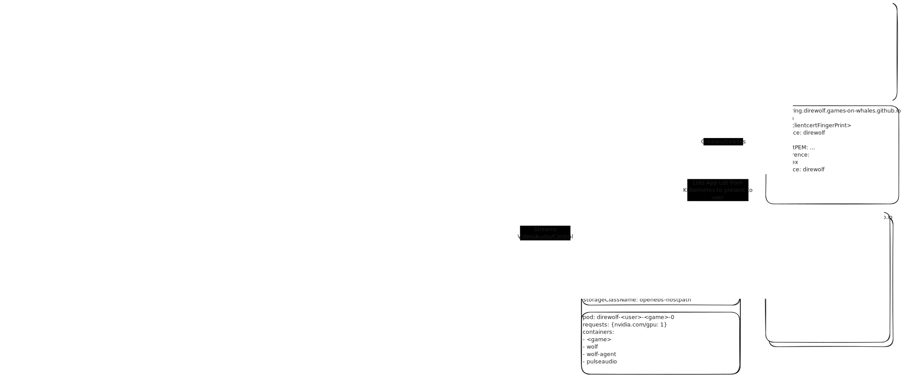

# fenrir
The leader of the pack - control multiple distributed instances of Wolf in K8S

NOTE: NOT IN A USEABLE STATE!

## High Level Idea


> Proof-of-Concept Diagram that is likely outdated

Wolf is designed for a single machine with multiple users. But when wolves come
together into a cluster they form a pack. Every pack needs a leader to coordinate
the other wolves.

This project currently has three components:

- `moonlight-proxy`
- `wolf-agent`
- `operator`

## moonlight-proxy

Moonlight proxy is the entrypoint for the user's moonlight requests. It hosts
a standard Moonlight HTTP/HTTPS server to handle pairing of users, and the
starting/stopping of games.

### Authentication/Authorization

To manage user sessions moonlight-proxy creates an instance of a CRD `Pairing`.
`Pairing` contains the association between the Moonlight client's certificate
and the user they are authenticated against.

When calls to HTTPS endpoint are made, `moonlight-proxy` calculates the fingerprint
of the client certificate, and looks up a matching `Pairing` to find the user that
is currently authenticated.

#### PIN Codes

moonlight-proxy presents the same PIN code page as wolf with nothing special
attached. Eventually it should be protected by HTTPS Oauth proxy to associate user to client.

### App Lists

Apps are stored in a CRD on Kubernetes called `App`. Moonlight-proxy renders
the list as XML to return to Moonlight client to present to the user.

### Orchestration

In response to `/launch` or `/resume` from Moonlight client launching an app,
`moonlight-proxy` creates a `Session` object which associates `User`, `Game`,
and `Pairing` for the specific client used. It then waits for the `Session`
to have an `rtsp` URL added to its status by the `operator` to hand back to the uses.

## wolf-agent

Wolf-Agent is a sidecar container with Wolf's HTTP API socket mounted locally.
It is responsible for synchronizing the intended list of sessions in Kubernetes
with the currently active sessions in wolf, as well as calling `fake-udev` for
controller support.

## Operator

The operator is a component which runs a leader election and control loops
for all of the CRDs used for Wolf. The only really interesting one is `Session`.
The loop for `Session` is responsible for setting up port forwards, PVCs,
deployments, and more.

In the future the operator will also expose a subset of Wolf API for WolfManager
to communicate with (to manage lists of apps, for instance). This implementation
will simply create k8s api objects.

Only one operator is running the writable control loop at a time. Only 2-3 replicas
are ever needed just for high availability. A single active operator is likely 
enough to handle all the sessions created by a single IP (as it is only in the loop for creation/deletion)

### Pod Layout

Each pod spawned by `operator` has multiple containers:

- User's Game Container
- Wolf-Agent
- Wolf
- Pulseaudio

Each of these at least have a common `XDG_RUNTIME_DIR` as well as some other
specific mounts for each of them.

User's Game Container MUST have a pre-launch script that waits for the `WAYLAND_DISPLAY`
socket to be created, otherwise the container will be in a crashloop, and the
Pod will never be `READY` for the `Service` to forward traffic to it.

### Port Forwarding

Port forwarding to the container is the lynchpin of this POC. And it actually
currently only works for a single session at a time until work is extended to
support additional ports.

#### Load Balancer Service

The current method used by this POC is to use a special LoadBalancer feature
of Cilium to implement the port forwards. The basic idea is that one set of ports
(HTTP/HTTPS) go to `moonlight-proxy`, and the other set `RTSP/RTP/ENET` go to `wolf`
running alongside the game. This allows us to have a single `moonlight-proxy`
serving many sessions hosted by many whales.

When a `Session` is created, `Operator` will choose a set of RTSP/RTP/ENET ports
to use, and create a `Service` pointed at `wolf` for them with a special cilium
annotation `lb-sharing-key` to enable sharing of the same IP used for moonlight.

#### Alternative Design Idea: Gateway API

Rather than special cilium load balancer annotation, a better method would be
to create `UDPRoute` and `TCPRoute` objects from https://gateway-api.sigs.k8s.io

This is a general purpose port-forwarding API for Kubernetes from Public Virtual
IPs. It is a great alternative to special LB sharing annotations.

#### Alternative Design Idea: Full Dumb Relay

I didn't attempt to implement a relay. Maybe someone can try it so we have a
general purpose implementation "that just works" for everyone.

#### Alternative Design Idea: Implement RSTP + RTP PING, Use Relay for ENET

This idea requires some method of masquerading Egress traffic from `wolf` pods.
Cilium has an easy way to do this, but other methods may not.

The basic idea would be that we dont need to forward any ports if we implement
the RTSP handshake, RTP PING in `moonlight-proxy`. Once direwolf gets the
IP/PORT of the moonlight client it can have `wolf` just start uploading a stream,
as long as it can fake the source IP of the packets from `wolf`.

## Getting started:
Before you start you should install metallb and configure a loadbalancing ip pool.


Then, install the operator to the your k8s cluster:  
`kubectl apply -f examples/install.yaml`

### Using Generic Devices to pass the gpu to the pods  
In order for wolf to render / stream the images you need to pass it a device that can do it, I've an AMD gpu, so I opted to use generic devices to pass the `dri` device

first check the content of `/dev/dri`:  
```
$ ls /dev/dri/
>by-path  card1  renderD128
```
then go to the `examples/generic-devices.yaml` to edit the dri device path to be the same as the desired card.  
```
- path: /dev/dri/renderD128 |->|- path: /dev/dri/renderD128
- path: /dev/dri/cardX      |->|- path: /dev/dri/card1
```

finally apply it:  
`kubectl apply -f examples/generic-devices.yaml`
This should add the gpu as a sharable resource that can be used in the next step.

### Creating a user  
as of now, alex is the hardcoded user, don't change the name in the `examples/user.yaml` or `examples/user_generic_device_gpu.yaml`

However you can change the resources and volume mounts for the sidecars:
- wolf: This one requires a gpu for encoding
- wolf-agent
- pulseaudio


To create a user:  
`kubectl apply -f examples/user_generic_device_gpu.yaml`

### Adding an application and pairing with moonlight  
add the app the to cluster using:  
`kubectl apply -f examples/testball.yaml`

Next get the ip of the loadbalancer service to connect with moonlight:  
`kubectl get svc direwolf -n direwolf -o jsonpath='{.status.loadBalancer.ingress[0].ip}'`

open moonlight to pair with the acquired ip  
then get the moonlight-proxy pairing url through the logs:  
`kubectl logs -n direwolf deployments/direwolf-moonlight-proxy`

use it to pair and then connect with the app, it'll take a moment to pull the image, so the first pairing might fail.  

